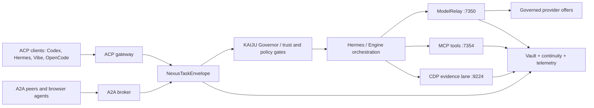
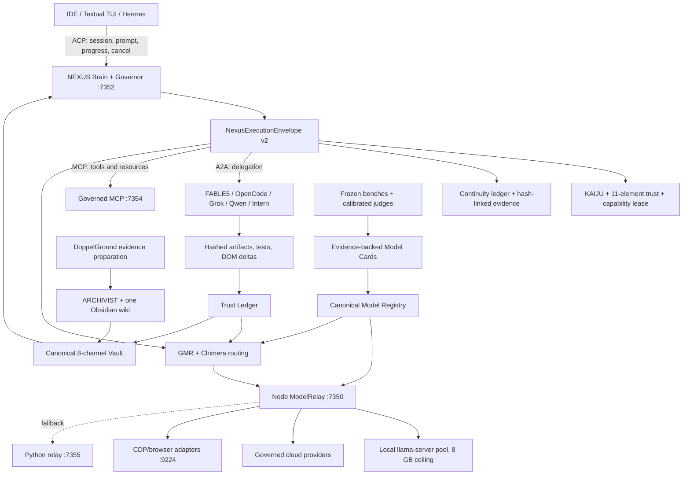

# NEXUS SOL Ultimate: Master Integration & Convergence Plan (Revised)

This integration plan presents the canonical convergence blueprint for **NEXUS SOL Ultimate**, combining the research lanes of **FABLE5**, **OpenCode**, **Grok 4.5**, and **Codex/SOL** under the local **8GB VRAM constraint**. 

It corrects the model routing architecture by unifying **ModelRelay**, **MCP Tools**, and the **CDP Evidence Lane** under the **Hermes / Engine Orchestration** plane, using the exact architectural specifications and mermaid diagrams from your grounding guidelines.

---

## 1. Goal and Background
NEXUS OS contains multiple sophisticated subsystems (Brain, ModelRelay, Vault, GMR, and CDP Supervisor) that must be integrated to prevent fragmentation. The model registry currently contains synthetic default scores (like `0.45`), ModelRelay has divergent model counts, and memory admission lacks Merkle-anchored lineage.

This plan corrects prior layout errors by establishing:
1. **Unified Ingestion & Governor Gate**: Both ACP (Editor/CLI client) and A2A (agent-to-agent) requests feed into the **NexusExecutionEnvelope**.
2. **Hermes Orchestration**: Hermes acts as the central engine, executing tasks across three unified pipelines: **ModelRelay (:7350)**, **MCP Tools (:7354)**, and the **CDP Evidence Lane (:9224)**.
3. **ModelRelay Consolidation**: All LLM inference (Local `llama-server`, Cloud NIMs, or Browser CDP endpoints) routes through Node ModelRelay.
4. **Agent Orchestration**: Trinity coordinate swarms and Dawid-Skene Peer-Review are agent-level patterns running inside the execution envelope, consuming ModelRelay and MCP.
5. **Continuous Telemetry Loop**: All execution channels write outputs back to the **Vault + continuity + telemetry** store, updating the 8-channel memory and trust ledger.

---

## User Review Required

> [!IMPORTANT]
> **llama-server Router-Mode Migration**: We are replacing the local Ollama dependencies with a native `llama-server` router-mode setup (single Windows CUDA process). This implements preset pinning, sleep-idle unloading, and rotatable slots, allowing us to run our local stack (`Qwen2.5-Coder 1.5B`, `DeepSeek-R1-Distill 1.5B`, `VibeThinker 3B`, and `Nemotron Safety Guard 8B`) under the strict 8GB VRAM limit.

> [!WARNING]
> **Intern HARD_STOP Rule**: Automatic CDP-driven restarts of Intern workers are explicitly prohibited to prevent loop-locking and quota exhaustion. Intern runs exclusively on human-driven GPU benchmark/training tasks unless the user requests a single short-burst execution.

---

## Proposed Changes

We replace the split routing architecture with the unified NEXUS SOL Ultimate workflow.

### Horizontal Flow (Northbound-to-Southbound Pipeline)

### Vertical Architecture Map

---

### Component 1: 8-Channel Memory & Merkle Lineage (Wave 4)
We make the 8-channel memory schema canonical and implement Merkle-anchored lineage.

#### [MODIFY] [memory_channels.py](file:///C:/Users/speci.000/Documents/NEXUS/nexus_os/vault/memory_channels.py)
- Enforce the 8-channel structure: Sensory (0), Working (1), Episodic (2), Semantic (3), Procedural (4), Trust (5), Task (6), and Meta (7).
- Unify legacy 5-track datasets using read/write schema adapters.

#### [NEW] [mem_lineage.py](file:///C:/Users/speci.000/Documents/NEXUS/nexus_os/vault/mem_lineage.py)
- Implement Merkle-anchored signatures and derivation DAGs (`MemLineage` pattern) to track memory provenance.
- Prevent memory-laundering attacks by isolation per principal.

#### [MODIFY] [doppelground_bridge.py](file:///C:/Users/speci.000/Documents/NEXUS/nexus_os/archivist/doppelground_bridge.py)
- **Remove the default trust 90 assignment** (line 102).
- Derive admission trust dynamically based on provenance, corroboration, recency, license, and source-card evidence.
- Maintain DoppelGround as a one-way path: evidence preparation into NEXUS, never governance write-back.

---

### Component 2: 11-Element Non-Linear Trust Engine (Wave 4/5)
We implement the non-linear trust scoring and use it to regulate reinforcement learning.

#### [MODIFY] [trust_scoring.py](file:///C:/Users/speci.000/Documents/NEXUS/nexus_os/governor/trust_scoring.py)
- Bind the lane-specific params (`qmin`, `n0`, `Rcrit`, `alpha`, `beta`, `gamma`, `eta`, `kappa`, `delta`, `epsilon`) for `RESEARCH`, `REVIEW`, `AUDIT_SECURITY`, `COMPLIANCE`, `IMPLEMENTATION`, `ORCHESTRATION`, and `SYNTHESIS`.
- Output the non-linear tanh trust delta score to the `TrustLedger`.
- Feed the trust delta score directly as a scalar reward input in our offline **GRPO (Group Relative Policy Optimization)** fine-tuning loops.

---

### Component 3: Local llama-server & GMR Rotator (Wave 1/3)
We transition local serving to a single `llama-server` process under the 8GB VRAM ceiling.

#### [MODIFY] [model_rotator.py](file:///C:/Users/speci.000/Documents/NEXUS/nexus_os/gmr/model_rotator.py)
- Move local serving from Ollama to `llama-server` router mode.
- Pin local anchors (`Qwen2.5-Coder 1.5B`, `DeepSeek-R1-Distill 1.5B`) to CUDA memory.
- Dynamic slot allocation: Swap `VibeThinker-3B` and `Nemotron Safety Guard 8B` in and out of GPU memory using idle-unload timers to prevent OOM errors.

---

### Component 4: Model Curation, Scoring v2 & Nvidia NIM (Wave 1/2)
We clean up the catalogue registry and implement rate-limit resilience for frontier NIM endpoints.

#### [MODIFY] [models.registry.json](file:///C:/Users/speci.000/Documents/NEXUS/config/models.registry.json)
- Remove synthetic default scores (like `0.45`) across the 112 affected models.
- Register real benchmark metrics (t^2 bench, SWE, SWE pro, Human last exam) under the `"evidence"` block.
- Add entries for Nvidia NIM models: `glm-5.2` (tier 96), `minimax-m3` (tier 95), `deepseek-v4-pro` (tier 96).

#### [MODIFY] [provider_adapters/nvidia/nim_client.py](file:///C:/Users/speci.000/Documents/NEXUS/nexus_os/bridge/provider_adapters/nvidia/nim_client.py)
- Implement exponential backoff retry logic (up to 5 retries with jitter) to handle **429 rate-limit exhaustion** during multi-agent calls.
- Fail over to local fallback models if the rate-limit remains exhausted after the max retry window.

---

### Component 5: CDP Browser Collaborative Swarms (Wave 3)
We configure the Chrome CDP supervisor as an intelligence-distillation engine.

#### [MODIFY] [external_browser_ai_director.py](file:///C:/Users/speci.000/Documents/NEXUS/tools/browser_ai_supervisor/external_browser_ai_director.py)
- Execute a **Trinity-style 3-role loop (Thinker, Worker, Verifier)** within the browser context.
- Unify with `peer_review.py` to run a Dawid-Skene Expectation-Maximization consensus check on output candidates.
- Run ClawTrojan and SEMA intent-drift filters on every text turn.
- Enforce the **Intern HARD_STOP rule**: CDP supervisor must never launch or restart Intern workers automatically; all execution remains manual or short-burst only.

---

### Component 6: Closing the 6 Scientific Research Gaps
We resolve the missing research foundation by creating and populating the `papers14` to `papers19` folders under `C:\Users\speci.000\Downloads\ARCHIVIST\PAPERS\`.

#### [NEW] [papers14-19 folders](file:///C:/Users/speci.000/Downloads/ARCHIVIST/PAPERS/)
- **`papers14/` (A2A Protocol & Inter-Agent Communication)**: Maps to `bridge/a2a_channels.py`, `nexusclaw/a2a_evidence.py`.
- **`papers15/` (Token Economics & Cost-Aware Routing)**: Maps to `token_guard.py`, `gmr/savings.py`.
- **`papers16/` (Sandboxing & Filesystem Confinement)**: Maps to `claw/policies/`, `sandbox/`, OpenShell.
- **`papers17/` (Swarm Coordination & Task Allocation)**: Maps to `swarm/foreman.py`, `swarm/auction.py`, `team/coordinator.py`.
- **`papers18/` (Steganography & Covert Channels)**: Maps to `security/steg/`, `ST3GG/` toolkit, `docs/IMAGE_STEGANOGRAPHY_ATTACK_BRIEF*.md`.
- **`papers19/` (Runtime Hallucination Monitoring)**: Maps to `monitoring/calibrated_hallucination_detector.py`, `monitoring/semantic_drift_monitor.py`.
- Create a `00_INDEX_<TOPIC>.md` and a `download_list.txt` in each folder detailing the literature mapping.

---

### Component 7: Agent Orchestration Contract
We codify the lane-ownership and path permissions to prevent collision in shared environments.

| Executor | Bounded Work | Explicitly Forbidden |
|---|---|---|
| **FABLE5** | Research synthesis, model/training hypotheses, benchmark design, architecture review. | Runtime restarts, branch-wide edits, unverified "done" claims. |
| **OpenCode** | Continuity, CLI, registry compiler, client synchronization, bounded backend slices. | Browser automation, architecture-policy changes. |
| **Grok 4.5** | MCP/CDP adapters, browser evidence, port/runtime checks, bounded Intern smoke. | Registry scores, memory schemas, training promotion, autonomous keepalive loops. |
| **Codex/SOL** | Task packets, leases, integration, verification, release claims. | Re-merging ancestral work, sweeping dirty-tree changes. |
| **Qwen** | Preview DOM evidence lane. | Chat-text success claims. |
| **Intern** | Human-driven GPU benchmark/training jobs. | Automatic CDP restart or unattended long-running control. |

---

## Verification Plan

### Automated Tests
1. **Model Registry Generation Test**:
   Execute `python scripts/gen_model_registry.py --check` to ensure the registry compile step works cleanly and contains no synthetic default scores.
2. **OpenCode Continuity Test**:
   Run `pytest tests/test_continuity.py` (which tests the compatibility of the 127 JSON continuity ledger records with the typed reader).
3. **ModelRelay GMR Rotation Test**:
   Verify slot swapping by running `pytest tests/model_relay/test_gmr_rotation.py` with mock `llama-server` endpoints.
4. **NIM 429 Retry Test**:
   Run a mock 429 response benchmark to verify the exponential backoff adapter executes correctly.
5. **SAGE Gateway Smoke Tests**:
   Run `python C:\Users\speci.000\.gemini\antigravity\brain\ca898454-93f5-4a06-8ed4-8442532aee22\scratch\test_sage_rest.py` and `test_public_sage.py` to verify all REST endpoints and Bearer auth.

---

### Component 8: NEXUS SAGE REST Façade & Action Gateway (Milestone S1 - COMPLETED)
We establish the REST facade mapping OpenAPI requests to the local MCP backend tools.

#### [MODIFY] [grok_mcp_server_v2.py](file:///C:/Users/speci.000/Documents/NEXUS/tools/browser_ai_mcp/grok_mcp_server_v2.py)
- Implemented `/v1/...` REST façade endpoints for all 15 SAGE operations (e.g. `/v1/health`, `/v1/tasks`, `/v1/evidence`, `/v1/registry`, `/v1/coordination/status`).
- Added Bearer authentication validating requests using the secure token `nxs_sage_062476a0c4614301afd91a9086f469d2fad8fa51b0df4db2a6a239106f5edcf6` (stored in `sage_api_key.txt`).
- Implemented sliding-window rate limiting (100 req/min) returning HTTP 429.
- Added payload size validation (<100,000 characters) returning HTTP 413.
- Implemented idempotency checking and receipt generation using a SQLite database `sage_gateway.db` in the runtime directory.
- Served `/privacy` returning the privacy policy HTML.

